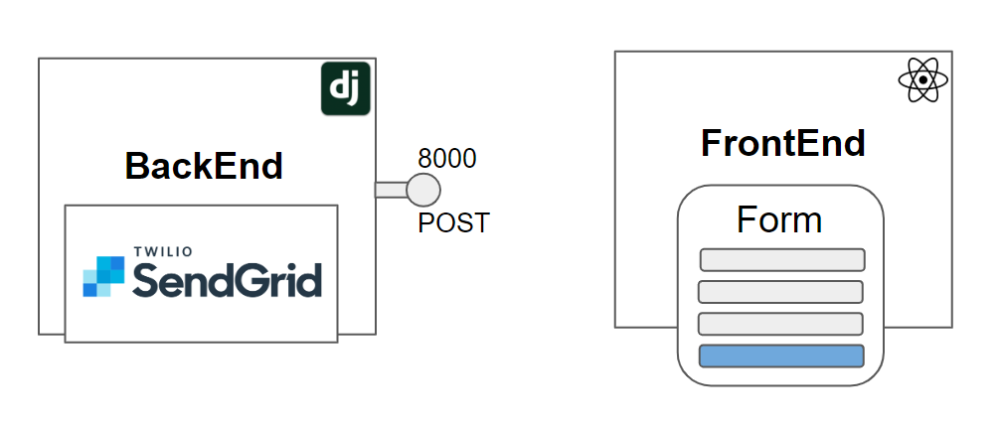

# form_wrapper 
An easier way to write forms. 
  
* 


## Motivation:
- **Code:**
  ```javascript
  import React from 'react'
  import { formWrapper, Email, TextArea, Button } from '../components/basics'

  class Page extends React.Component {
    static async getInitialProps ({ store }) {
      await store.dispatch(someAsyncAction())
      return {}
    }

    render () {
      return (
          <Form>
              <Email id="myEmail"> email@example.com </Email>
              <TextArea id="userComments"> Your comments </TextArea>
              <Button url="https://localhost:8003" post> Submit </Button>
          </Form>
      )
    }
  }
  ```
- **Request:**
  - URL: `https://localhost:8003`
  - Method: `POST`
  - Body: 
      ```json
      {
        "myEmail":"email@example.com",
        "userComments":"Your comments"
      }
      ```

## Getting Started

- **Requirements:**
  - `Python 3.6`
  - `Node v8.11.1`

- **Install dependencies:**
  ```
    npm install && pip install -r ./backend/requirements.txt
  ```
- **Run backend:**
  ```
    python manage.py runserver
  ```
- **Run frontend (in a different shell):**
  ```
    npm run dev
  ```

## Acknowledgements:
- redux-form and nextjs integration:
    https://gist.github.com/rockchalkwushock/ad9219314fb18ab736fc9b7e3c694c7a
- this.props.children manipulation:
    https://mxstbr.blog/2017/02/react-children-deepdive/

## Todo:
1) The request's method and url are hardcoded in the redux action.
2) Styled each component, (The form ui has to be improved).
3) Dockerized application.
4) Write unit testing.